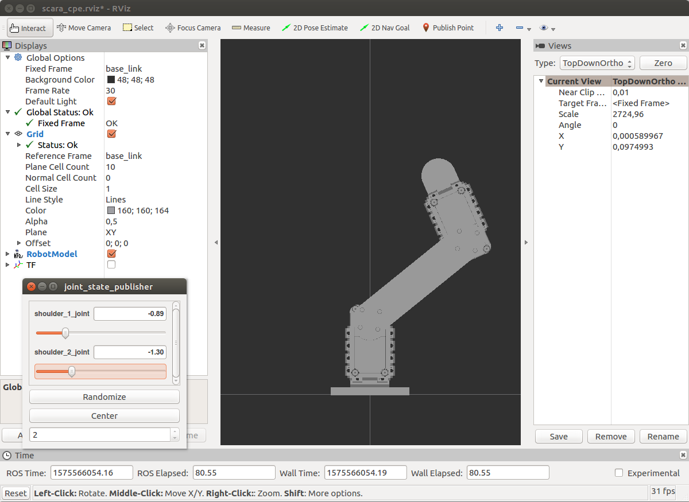
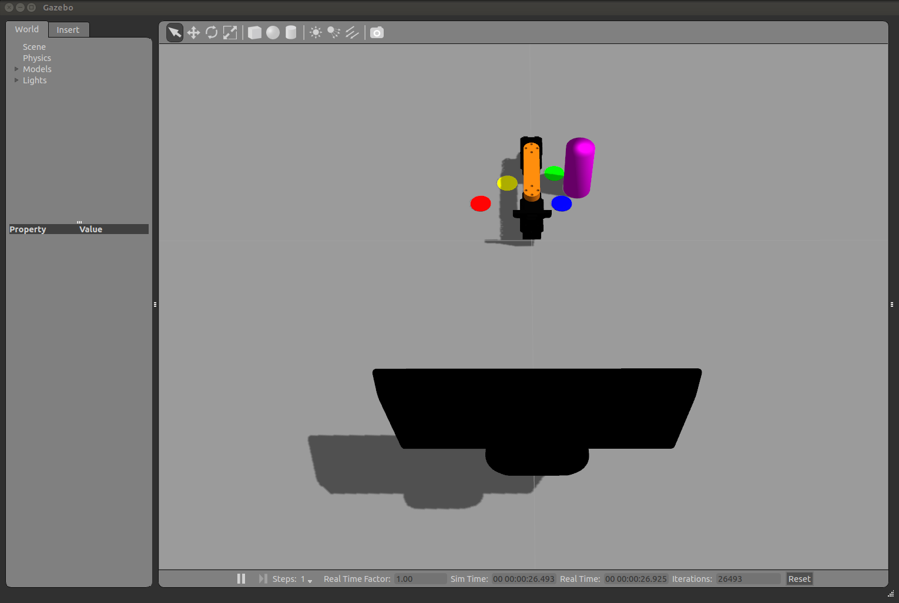
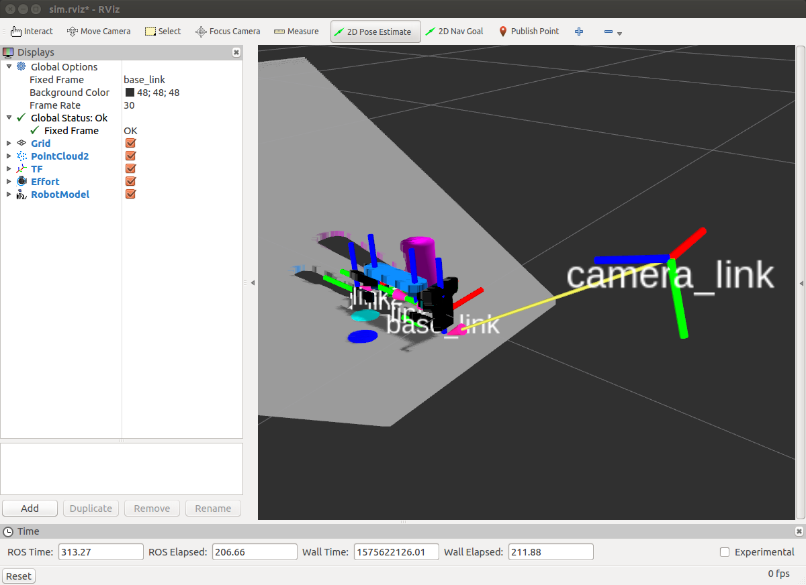
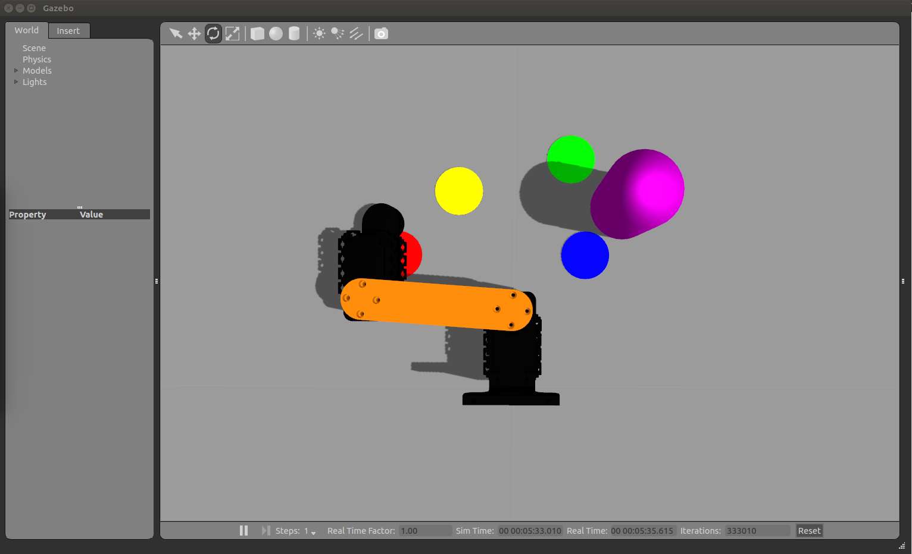
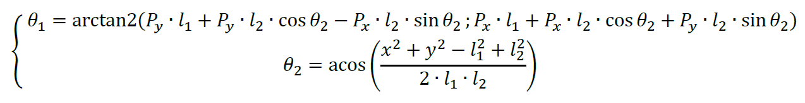
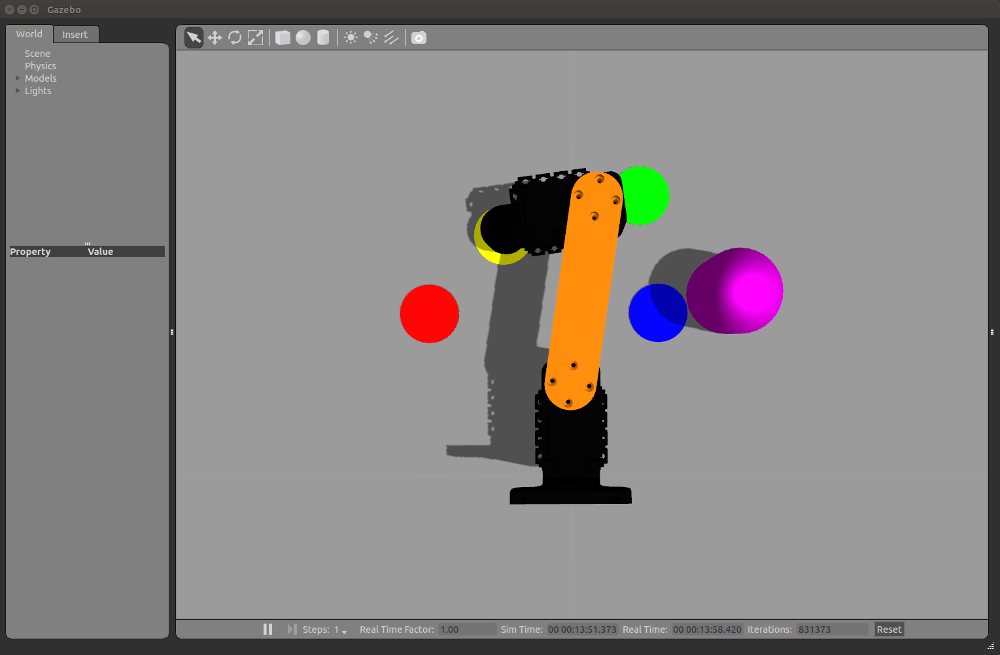

# Partie 1: Tools and techno introduction

Cette première partie permet de présenter plusieurs outils pour visualiser et manipuler le bras `Scare`.

**Fichiers créés dans cette partie :**
- [`gazebo_trajectory_action_client_test.py`](./programmes/src/scara_cpe_kinematics/script/gazebo_trajectory_action_client_test.py)
- [`ik_service_action_client.py`](./programmes/src/scara_cpe_kinematics/script/ik_service_action_client.py)
- [`ik_gazebo.launch`](./programmes/src/scara_cpe_kinematics/launch/ik_gazebo.launch)


## 1.1 URDF comes to life !

Avec la commande `$ roslaunch scara_cpe_description scara_cpe_gui.launch`, RViz s'ouvre avec une fenêtre pour contrôler la position de chaque servomoteur :


En analysant le *launch file* `scara_cpe_gui.launch`, il est possible d'observer les différentes actions qui sont réalisées :
- 3 Noeuds sont lancés :
	- `joint_state_publisher`
	- `robot_state_publisher`
	- `rviz`

- Le fichier `scara_cpe.xacro`, qui contient la description du bras, est chargé dans le paramètre `robot_description` grâce à une commande du terminal qui convertit le `xacro` au format `URDF`.

- L'affichage (GUI) est lancé grâce au noeud `rviz` qui utilise le fichier `scara_cpe.rviz` pour recharger une configuration. Et la fenêtre qui permet de contrôler la position de chaque servomoteur s'affiche grâce au paramètre `use_gui` qui est mis à `true`.

- `xacro` est un langage macro pour construire des fichiers `URDF`. Il simplifie ainsi la construction de fichiers `URDF` en laissant la possibilité d'utiliser des variables, des macros, ...


A partir du fichier URDF (xacro), il est possible d'extraire les informations suivantes :
- Nom des joints :
	- `base_fixed`
	- `camera_fixed`
	- `shoulder_1_joint`
	- `shoulder_2_joint`
	- `end_joint`

- Distance de `base_link` à l'effecteur lorsque le bras est tendu :
	- Additionner toutes les origines (`origin`) des joints situés entre `base_link` et `end_link` : 

			Joints: shoulder_1_joint, shoulder_2_joint, end_joint
			Somme des origins de chaque joint:
			  - x = 0
		  	- y = 0.048 + 0.080 + 0.047 = 0.175
			  - z = -0.025

	- La distance calculée est ainsi de `0.177 m` :

			distance = sqrt(x²+y²+z²) = 0.177 m


---
## 1.2 Gazebo simulation and RViz vizualisation

**Différence entre Gazebo et RViz :**
- Gazebo permet de simuler un robot dans un environnement
- RViz permet de visualiser des données

Donc, RViz utilise des données tandis que Gazebo utilise mais aussi créer de nouvelles données.

### Ouvrir Gazebo :

Pour lancer Gazebo :
```sh
$ roslaunch scara_cpe_gazebo gazebo_scara_playground.launch
```

Une fenêtre s'ouvre avec le bras Scara modélisée entouré de points colorés et d'un cylindre rose :

Une caméra `Kinect` est aussi présente dans l'environnement. Elle sera utilisée dans une des parties suivantes pour utiliser les informations de l'environnement lors du déplacement du bras.

### Description de l'environnement de Gazebo :

En analysant le fichier décrivant l'environnement `scara_cpe.world`, il est possible de récupérer les positions des différents objets :
- Point rouge :   [-0.073  0.08  0.0005]  A_point
- Point jaune :   [-0.035  0.12  0.0005]  D_point
- Point vert  :   [ 0.035  0.14  0.0005]  B_point
- Point bleu  :   [ 0.044  0.08  0.0005]  C_point
- Cylindre rose : [ 0.067  0.11  0.5000]  unit_cylinder_1

Liste de tous les topics disponibles : `$ rostopic list`
```
/camera/depth/camera_info
/camera/depth/image_raw
/camera/depth/image_raw/compressed
/camera/depth/image_raw/compressed/parameter_descriptions
/camera/depth/image_raw/compressed/parameter_updates
/camera/depth/image_raw/compressedDepth
/camera/depth/image_raw/compressedDepth/parameter_descriptions
/camera/depth/image_raw/compressedDepth/parameter_updates
/camera/depth/image_raw/theora
/camera/depth/image_raw/theora/parameter_descriptions
/camera/depth/image_raw/theora/parameter_updates
/camera/depth/points
/camera_ir/depth/camera_info
/camera_ir/parameter_descriptions
/camera_ir/parameter_updates
/clicked_point
/clock
/gazebo/link_states
/gazebo/model_states
/gazebo/parameter_descriptions
/gazebo/parameter_updates
/gazebo/set_link_state
/gazebo/set_model_state
/initialpose
/move_base_simple/goal
/rosout
/rosout_agg
/scara_cpe/joint_states
/scara_cpe/scara_cpe_controller/command
/scara_cpe/scara_cpe_controller/follow_joint_trajectory/cancel
/scara_cpe/scara_cpe_controller/follow_joint_trajectory/feedback
/scara_cpe/scara_cpe_controller/follow_joint_trajectory/goal
/scara_cpe/scara_cpe_controller/follow_joint_trajectory/result
/scara_cpe/scara_cpe_controller/follow_joint_trajectory/status
/scara_cpe/scara_cpe_controller/gains/shoulder_1_joint/parameter_descriptions
/scara_cpe/scara_cpe_controller/gains/shoulder_1_joint/parameter_updates
/scara_cpe/scara_cpe_controller/gains/shoulder_2_joint/parameter_descriptions
/scara_cpe/scara_cpe_controller/gains/shoulder_2_joint/parameter_updates
/scara_cpe/scara_cpe_controller/state
/tf
/tf_static
```

### Visualiser les données avec RViz :
A partir de RViz, il est possible de visualiser plusieurs données :
- `TF` : Visualiser les différents repères composant le bras
- `PointCloud2` : Les informations de profondeur et de couleur de la caméra `Kinect`
- `RobotModel` : 



(La configuration RViz est sauvegardée dans le fichier `scara_cpe_gazebo/config/sim.rviz`)

### Launch file Gazebo + RViz :
Pour lancer automatiquement Gazebo et RViz, un *launch file* a été créé : `scara_gazebo_rviz.launch`.
Pour le lancer :
```sh
$ roslaunch scara_cpe_gazebo scara_gazebo_rviz.launch
```


---
## 1.3 ROS Actions and Controllers

### ROS Action :
Une action ROS permet d'envoyer une commande d'un noeud qui nécessite beaucoup de temps pour fonctionner (par exemple : déplacer le bras). Durant l'exécution de la commande, il est aussi possible de récupérer des informations sur le déroulement de l'action et vérifier que tout fonctionne correctement ou non. Finalement, un dernier message permet d'indiquer que l'action est terminée.

Un message d'une action est composé d'un `goal`, `result` et `feedback`.

### Liste des topics d'une Action :
En listant les topics disponibles (`$ rostopic list`), il est possible de récupérer les topics qui correspondent à une action :
```
`/scara_cpe/scara_cpe_controller/follow_joint_trajectory/cancel`
`/scara_cpe/scara_cpe_controller/follow_joint_trajectory/feedback`
`/scara_cpe/scara_cpe_controller/follow_joint_trajectory/goal`
`/scara_cpe/scara_cpe_controller/follow_joint_trajectory/result`
`/scara_cpe/scara_cpe_controller/follow_joint_trajectory/status`
```

Ces topics servent lors de l'utilisation d'un `controller` qui permet le contrôle du déplacement du bras. 


### Utiliser une action :

Il est possible d'utiliser une action un programme Python pour contrôler la position du bras : `gazebo_trajectory_action_client_test.py`.

Pour tester :
- Démarrer `Gazebo` :
```sh
$ roslaunch scara_cpe_gazebo gazebo_scara_playground.launch
```
- Lancer le programme :
```sh
$ rosrun scara_cpe_kinematics gazebo_trajectory_action_client_test.py
```

Ce programme permet alors de tourner chaque servomoteur du bras :



---
## 1.4 Kinematics

L'action réalisée dans la partie précédente permet de contrôler le bras en envoyant directement les angles de chaque servomoteur composant le bras. Cela signifie qu'il est nécessaire de déterminer à chaque fois ces angles pour que le bras se place correctement dans l'environnement. (Ce n'est pas très efficace).
Ainsi pour simplifier le déplacement du bras, il est possible de réaliser un `Modèle Géométrique Inverse` qui permet d'envoyer une position `(x,y)` de l'environnement et d'obtenir les angles `(theta_1, theta_2)` du bras. 

### Modèle Géométrique Inverse (MGI) :
Pour convertir une position en angle, il est d'abord nécessaire de réaliser une étude du bras et de déterminer l'équation pour obtenir les angles `(theta_1, theta_2)` à partir d'une position `(x,y)` :


(Equation obtenue durant un ancien module de Robotique : *Modélisation des robots*)


### Service GoToXY :

A partir de l'équation, il est ensuite possible de créer un service pour contrôler directement en position `(x,y)` le bras.
Ce service se trouve dans le programme `ik_service_action_client.py`

#### Tester le service :
- Démarrer `Gazebo` :
```sh
$ roslaunch scara_cpe_gazebo gazebo_scara_playground.launch
```

- Démarrer le serveur du service `GoToXY` :
```sh
$ rosrun scara_cpe_kinematics ik_service_action_client.py
```

- Utiliser le service `GoToXY` :
	- Depuis un terminal, avec la commande :
	```sh
	$ rosservice call /gotoxy "x: -0.035
	y: 0.12"
	```
	- Ou avec le plugin `Service Caller` de `rqt` :
	```sh
	$ rqt
	``` 

Ce service permet donc de placer très facilement le bras sur un point de couleur, le jaune par exemple aux coordonnées `(-0.035, 0.12)` :



#### Launch file :
Pour simplifier l'utilisation du service avec `Gazebo`, un *launch file* a été créé : `ik_gazebo.launch`.

Ainsi, pour le lancer :
```sh
$ roslaunch scara_cpe_kinematics ik_gazebo.launch
```


