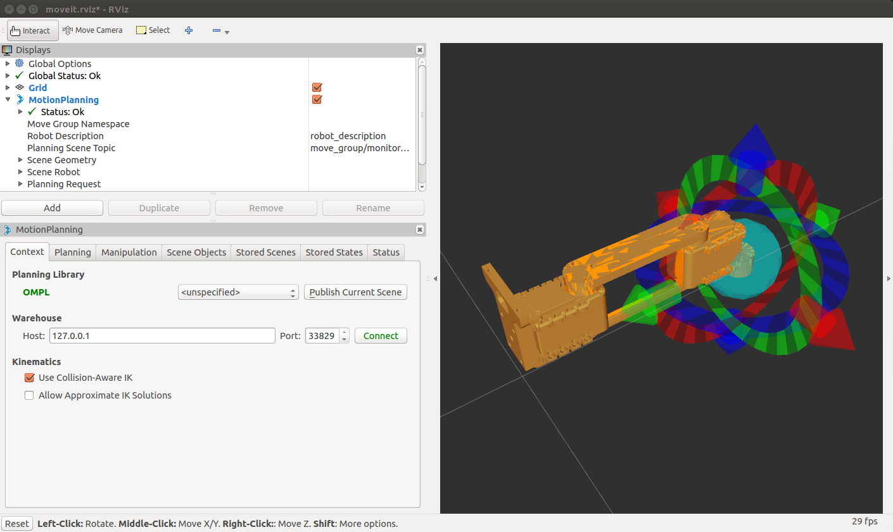
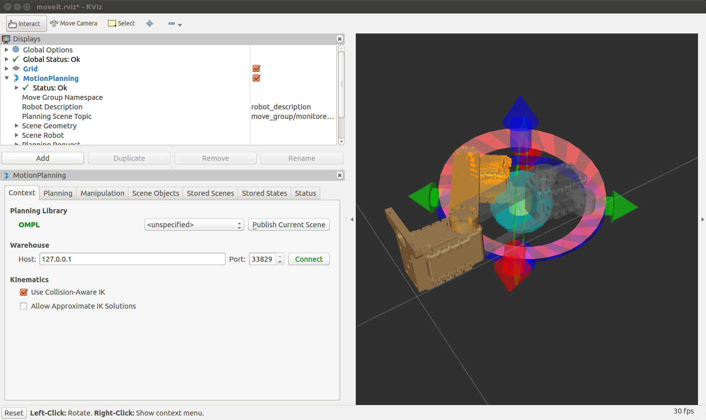
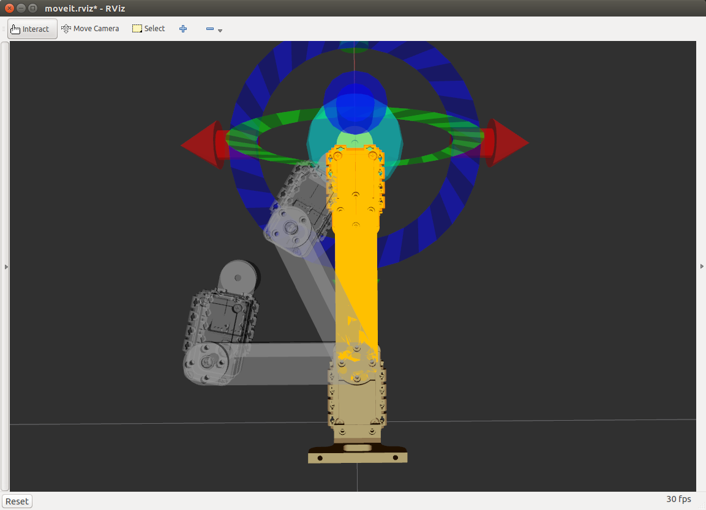
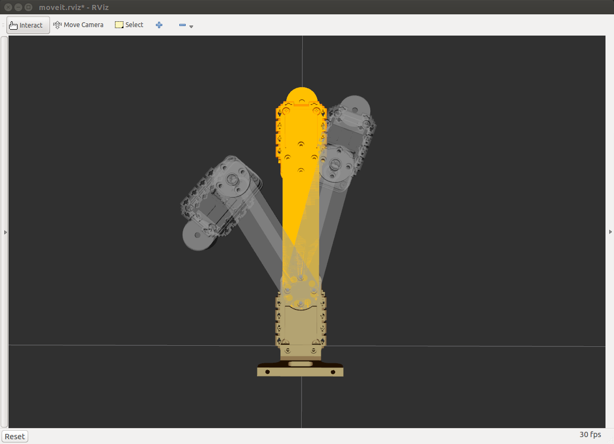

# Partie 2 : MoveIt!

**Fichiers créés dans cette partie :**
- [`moveit_test_named_target.py`](./programmes/src/scara_cpe_apps/script/moveit_test_named_target.py)
- [`moveit_test_poses.py`](./programmes/src/scara_cpe_apps/script/moveit_test_poses.py)
- [`moveit_test_path.py`](./programmes/src/scara_cpe_apps/script/moveit_test_path.py)
- [`moveit_test_fails.py`](./programmes/src/scara_cpe_apps/script/moveit_test_fails.py)


## 2.1 Introduction to MoveIt!
 
**Explain why is MoveIt! worth replacing your gotoXY service ?**
 
`MoveIt!` est un outil beaucoup plus complet que le service `gotoxy` développé.
`MoveIt!` est capable de déterminer la trajectoire du bras tout en respectant un grand nombre de contraintes liées au bras mais aussi à l'environnement autour. Ainsi, il est capable de définir une trajectoire tout en évitant la collision entre les éléments qui constituent le bras, mais aussi en prenant en compte les éléments autour. De même, cet outil est capable de déterminer automatiquement le modèle cinématique inverse à partir de la forme du robot (contenu dans un fichier `URDF`), ainsi il n'y a plus besoin de le déterminer soi-même (en utilisant des outils mathématique...).
`MoveIt!` est donc un outil généraliste de contrôle de bras robotique.
 
 
**What are the limitations of the default solver ?**
 
Le résolveur par défaut fonctionne uniquement pour les bras avec plus de 6 DoF, ainsi si le bras possède un nombre inférieur à 6 DoF, il est tout de même possible d'utiliser `MoveIt!` en ajoutant le plugin `ikfast` ou `Trac-IK`.
 
 
**In what way could a MoveIt! solution be associated with your analytical IK solution ?**
 
Pour utiliser son propre solveur analytique avec `MoveIt!`, il faut créer le solveur autour de la classe `moveit_core::KinematicsBase`. Tous les calculs sont réalisés à partir de la fonction `InverseKinematics::ik` qui prend en entrée `KDL::Frame` et renvoie un résultat de type `KDL::JntArray` (qui correspond aux positions de chaque joint).


---
## 2.2 Setup MoveIt! package

Pour intégrer `MoveIt!` sur un robot, il suffit de lancer l'`Assistant d'installation` :
```sh
$ roslaunch moveit_setup_assistant setup_assistant.launch
```

Cet outil nécessite uniquement un fichier `URDF` (ou `xacro`) pour démarrer la configuration. L'assistant permet ensuite de décrire comment sont structurés les différents éléments du robot.

A la fin, un package est généré, et permet de facilement tester l'implémentation de `MoveIt!` avec la commande :
```sh
$ roslaunch scara_cpe_moveit demo.launch`
```
`RViz` s'ouvre et le bras s'affiche :


Avec cette interface, il est possible de déplacer le bras en déplaçant la "balle bleu" et de générer le chemin et déplacer le bras vers cette nouvelle position : `Plan & Execute`.



---
## 2.3 Python program to move your robot with MoveIt!

`MoveIt!` peut être utilisé dans un programme Python pour contrôler les déplacements d'un bras.

Plusieurs programmes ont été réalisé permettent d'exploiter différentes fonctionnalités de `MoveIt!` : 
- Démarrer d'abord, l'outil de visualisation :
```sh
$ roslaunch scara_cpe_moveit demo.launch
```
- Puis, lancer indépendamment chaque programme :
  ```sh
  $ rosrun scara_cpe_apps <python_file>
  ```
  Avec `<python_file>`, remplacé par :
  - `moveit_test_named_target.py` : déplace le bras sur des positions prédéfinis durant l'initialisation avec l'assistant : `straight`, `left` ou `right` grâce à la fonction `set_named_target()`
  - `moveit_test_poses.py` : déplace le bras sur différentes positions grâce à la fonction `set_joint_value_target()`
  - `moveit_test_path.py` : déplace le bras en suivant un chemin grâce à la fonction `compute_cartesian_path()`
  - `moveit_test_fails.py` : réalise plusieurs déplacements qui ne s'exécutent pas comme attendu.


### Observations pour le programme `moveit_test_fails.py`

Le programme `moveit_test_fails.py` contient plusieurs étapes pour tester les limites du déplacement du robots :
- **Etape 1 :**
  - **Instructions :** Déplacement du bras sur la pose `straight` puis à la position `(0, 0.13)`.
  - **Observations :** Après s'être placé sur la pose, la commande `(0, 0.13)` n'est pas exécutée car le bras est déjà le mieux placé pour atteindre cette position (ce point se trouve en dehors de l'espace atteignable).

- **Etape 2 :**
  - **Instructions :** Déplacement du bras à la position `(0.11, 0.05)` (à tester avec Gazebo, cf. [Partie 3](./PART_3.md)).
  - **Observations :** Pour réaliser ce déplacement, le bras passe à travers le cylindre rose comme s'il n'était pas présent.

- **Etape 3 :**
  - **Instructions :** Déplacer le bras à la pose `right`, puis aller à un autre point grâce à la fonction `set_joint_value_target()`.
  - **Observations :** Rien de particulier à observer (à moins que ce n'est pas le bon point à tester)


### Modification du solveur

Il est possible de modifier le solveur qui permet de trouver `Modèle Géométrique Inverse` du bras du `solver KDL` par une implémentation analytique :
- Relancer l'assistant de MoveIt! :
  ```sh
  $ roslaunch scara_cpe_moveit setup_assistant.launch
  ```
- Dans `Planning Groups`, éditer `scara_cpe_group` en modifiant `solver KDL` par `scara_cpe_scara_cpe_group_kinematics/IKFastKinematicsPlugin` .
- Regénérer le package.
- `make` et `source` le workspace :
  ```sh
  $ catkin_make && source devel/setup.bash
  ```

En modifiant le solveur, il est possible d'observer que la solution pour placer le bras à une position utilise la *solution coude bas*, alors que le précédent solveur donnait la *solution coude haut*.

- `Solver KDL`, solution coude haut :
  

- `IKFastKinematicsPlugin`, solution coude bas :
  


(La position finale du bras est celle où le bras est le plus à gauche)
