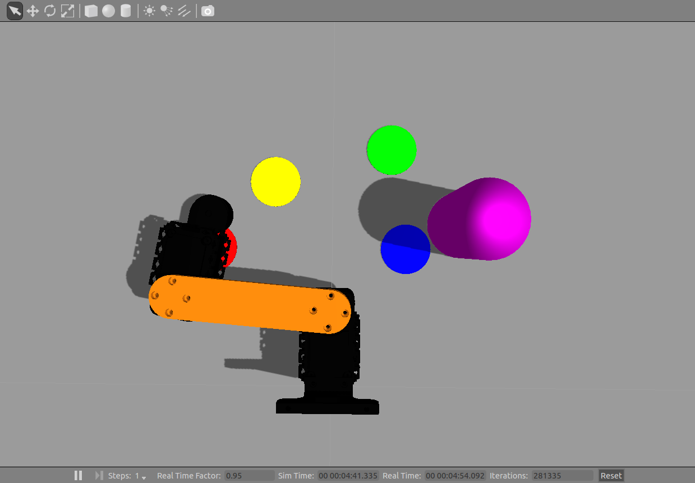

# Partie 3 : Lien entre `Gazebo` et `MoveIt!`

Pour les instructions détaillées pour relier `Gazebo` et `MoveIt!` : [Sujet](https://github.com/m0rph03nix/scara_cpe_4students/wiki/PART-3---Link-MoveIt!-to-the-robot-(gazebo))

**Fichiers créés dans cette partie :**
- [`controllers.yaml`](./programmes/src/scara_cpe_moveit/config/controllers.yaml)
- [`moveit_planning_gazebo.launch`](./programmes/src/scara_cpe_moveit/launch/moveit_planning_gazebo.launch)
- [`sensors.yaml`](./programmes/src/scara_cpe_moveit/config/sensors.yaml)
- [`sensor_manager.launch.xml`](./programmes/src/scara_cpe_moveit/launch/sensor_manager.launch.xml)

## 3.1 Link Gazebo controller and joint_state feedback

Le lien entre `Gazebo` et `MoveIt!` se réalise en ajoutant et modifiant quelques fichiers : `controllers.yaml`, `scara_cpe_moveit_controller_manager.launch.xml` et `moveit_planning_gazebo.launch`

**Pour utiliser Gazebo :** vérifier que le contenu du fichier `controllers.yaml` est identique à `controllers.gazebo.yaml`.

**Pour tester**, il suffit d'exécuter les instructions suivantes :
- Lancer `Gazebo` :
  ```sh
  $ roslaunch scara_cpe_gazebo gazebo_scara_playground.launch
  ```
- Lancer `MoveIt!` :
  ```sh
  $ roslaunch scara_cpe_moveit moveit_planning_gazebo.launch
  ```
- Lancer un programme de la partie précédente, par exemple : 
  ```sh
  $ rosrun scara_cpe_apps moveit_test_poses.py
  ```

Si la configuration s'est correctement réalisée, le bras bouge de la même manière que pour la partie précédente mais cette fois aussi dans `Gazebo` :



---
## 3.3 Ajouter un capteur de Gazebo pour MoveIt!

`MoveIt!` est capable d'utiliser des capteurs extérieurs au bras pour mieux connaître l'environnement.

Ainsi après avoir ajouté la simulation d'une caméra `Kinect`, il est possible de vérifier comment `MoveIt!` utilise ces nouvelles données.
- Lancer `Gazebo` :
  ```sh
  roslaunch scara_cpe_gazebo gazebo_scara_playground.launch
  ```
- Lancer `MoveIt!` :
  ```sh
  roslaunch scara_cpe_moveit moveit_planning_gazebo.launch
  ```
- Ajouter un cube dans le champ de vision de la `Kinect`.
- Lancer un programme de la partie précédente, par exemple :
  ```sh
  $ rosrun scara_cpe_apps moveit_test_poses.py
  ```


### Observations :

Tout d'abord, l'ajout de la caméra `Kinect` ajoute des données visibles dans `RViz` :


Ce nouvel affichage permet de détecter des objets autour du bras. Cependant, il semble ne pas détecter les obstacles proches du bras, comme par exemple le *cylindre rose*.

En ajoutant un obstacle dans le chemin de déplacement du bras, celui-ci est poussé comme s'il n'existait pas :


En observant les informations de RViz, il est possible de voir que l'obstacle est détecté uniquement lorsque le bras n'est pas juste à côté :


Le bras n'est donc pas considéré comme un obstacle, et rend indétectable les obstacles qui sont autour.

Ainsi, `MoveIt!` ne semble pas utiliser la caméra pour éviter des obstacles. A moins qu'il soit capable uniquement d'utiliser ces informations lorsque l'obstacle est déjà défini avant la génération de la trajectoire, mais cela ne semble pas marcher ici.

Par conséquent, `MoveIt!` ne s'adapte à l'environnement si des obstacles apparaissent dans la trajectoire calculée. Une solution, pour résoudre ce problème, serait d'ajouter des capteurs sur le bras pour détecter directement si un obstacle est proche. Il serait ensuite possible d'adapter la trajectoire pour l'éviter.
(Ce serait l'équivalent de créer un *local planner* pour le bras)
